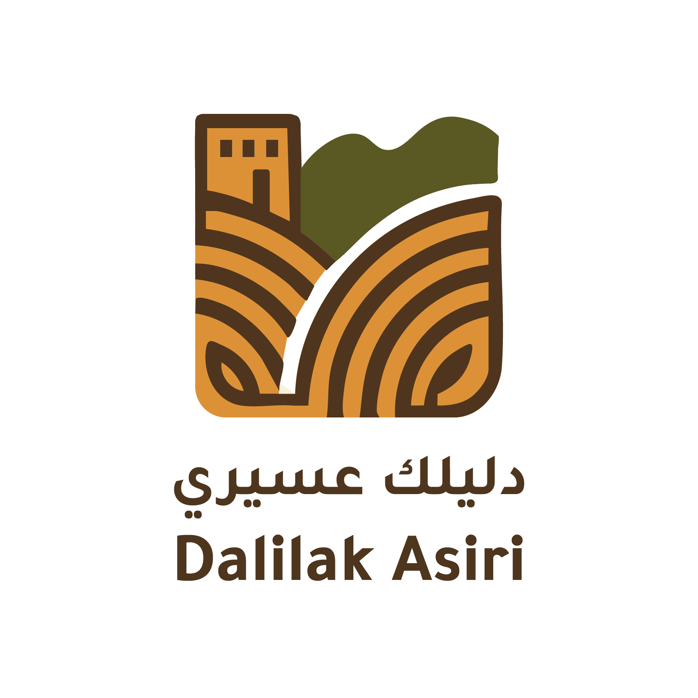

  

<h1 align="center">دليلك عسيري</h1>

<strong>رحلة شاملة... تجربة أصيلة</strong>

  
  
  

  <em>الواجهة الخلفية - قاعدة البيانات - التصميم</em>

---

## 📌 نبذة عن المشروع

"دليلك عسيري" هو تطبيق سياحي ذكي يقدم تجربة مخصصة لكل سائح في منطقة عسير، من خلال ربطه بمرشد محلي يتوافق مع اهتماماته، وذلك باستخدام خوارزميات توصية تعتمد على البيانات.

---

## ❗ المشكلة

- غياب منصة موثوقة تربط السياح بالمرشدين المحليين لتقديم تجارب أصيلة ومخصصة.
- ضعف تخصيص التجربة السياحية وتكرار زيارة الوجهات التقليدية.
- فقدان التفاعل مع الثقافة المحلية.

---

## 💡 الحل

- تطبيق ذكي يمكّن السائح من تحديد اهتماماته.
- النظام يقدم له توصيات مخصصة ويرشّح له المرشد المناسب.
- إمكانية الحجز والدفع الإلكتروني، مع نظام تقييم يضمن الجودة.

---

## ⚙️ التقنيات المستخدمة (فعليًا)

| المكوّن             | التقنية                  |
|--------------------|--------------------------|
| الواجهة الخلفية    | FastAPI                  |
| قاعدة البيانات      | Supabase + PostgreSQL    |
| التصميم            | Figma (بديل مؤقت لـ Flutter) |

## 🤖 الذكاء الاصطناعي

يعتمد "دليلك عسيري" على نظام توصية ذكي يربط السائح بالمرشد الأنسب بناءً على اهتماماته والموقع الجغرافي. تم تجربة أربع خوارزميات مختلفة، ومقارنتها عمليًا باستخدام بيانات واقعية، لاختيار النموذج الأكثر دقة وكفاءة.

### 🔬 مقارنة الخوارزميات

| الخوارزمية              | نوع التوصية              | متوسط الدقة | زمن التنفيذ | أبرز الملاحظات |
|-------------------------|--------------------------|--------------|---------------|----------------|
| Content-Based Filtering | حسب الاهتمامات المصنفة   | 0.71         | 0.5 ثانية     | تعتمد على تقاطع الاهتمامات؛ جيدة لكن محدودة إذا كانت البيانات غير متوازنة |
| KNN User-Based          | حسب تشابه المستخدمين     | 0.68         | 1.1 ثانية     | تتطلب بيانات تفاعل كبيرة؛ غير دقيقة مع مستخدمين جدد |
| SVD                     | تحليل مصفوفة التفاعل     | 0.65         | 1.7 ثانية     | تحتاج حجم بيانات أكبر للاستقرار؛ نتائجها غير ثابتة في الحالات الصغيرة |
| TF-IDF + KNN (Hybrid)   | توصية نصّية هجينة        | **0.78**     | **0.4 ثانية** | أكثر استقرارًا، تعمل حتى مع بيانات بسيطة، وتعطي نتائج منطقية من أول استخدام |

> تمت تجربة جميع الخوارزميات باستخدام بيانات فعلية ضمن بيئة Colab، وتم التحقق من مخرجات كل نموذج بناءً على قرب النتائج من توقعات الفريق ومحتوى البيانات المدخلة.

---

### ✅ لماذا اخترنا TF-IDF + KNN؟

تم اعتماد هذا النموذج كأفضل خيار حالي لعدة أسباب:

- **فعّال حتى مع حجم بيانات صغير** (مناسب لمراحل المشروع الأولى)
- **يعتمد على تحليل نصوص الاهتمامات مباشرة** دون الحاجة لهيكلة معقدة
- **يعطي توصيات قابلة للتفسير** (مثلاً: "هذا المرشد لديه اهتمامات مشابهة لاهتماماتك")
- **سريع في التنفيذ وقابل للتوسعة مستقبلاً** مع بيانات إضافية مثل التقييمات أو الأنشطة

---

---

## 🗂️ هيكل المشروع

| المجلد / الملف         | الوصف                                                 |
|------------------------|--------------------------------------------------------|
| `ai_models/`           | كود نماذج الذكاء الاصطناعي وتحليلات التوصية         |
| `api/`                 | ملفات الواجهة الخلفية باستخدام FastAPI               |
| `database/`            | يحتوي على ملف schema.sql لهيكل قاعدة البيانات       |
| `assets/`              | صور ومواد مرئية للمشروع أو العرض التقديمي            |
| `README.md`            | هذا الملف التعريفي للمشروع                            |

---

## 📆 خطة العمل

- المرحلة 1 (0–2 شهر): بناء النموذج الأولي وتجربة المستخدم.
- المرحلة 2 (3–4 شهر): إطلاق النسخة التجريبية وتدريب المرشدين.
- المرحلة 3 (5–8 شهر): تحسينات وتوسيع البيانات والتوصيات الذكية.
- المرحلة 4 (9–12 شهر): الإطلاق الرسمي وبداية التوسع الجغرافي.

---

## 📊 الأثر الاقتصادي والمجتمعي

- تمكين اقتصادي مباشر للمرشدين المحليين.
- تحفيز قطاعات مثل المقاهي، النقل، الفعاليات، والحرف اليدوية.
- رفع جودة التجربة السياحية في عسير وتعزيز شهرتها كوجهة متميزة.

---

## 🧩 هيكل قاعدة البيانات

ملف `database/schema.sql` يحتوي على تعريف الجداول التالية:

- `users`
- `guides`
- `guide_tags`
- `user_interests`
- `interactions`

---
### 🗺️ رسم قاعدة البيانات (Database Schema)

---

### 📊 محتوى الجداول

| الجدول           | عدد الصفوف | وصف مختصر                           |
|------------------|------------|-------------------------------------|
| `users`          | 150        | يحتوي على بيانات المستخدمين        |
| `guides`         | 150        | معلومات المرشدين السياحيين         |
| `guide_tags`     | 364        | التصنيفات المرتبطة بكل مرشد        |
| `user_interests` | 316        | اهتمامات المستخدمين                |
| `interactions`   | 200        | سجل التفاعل والتقييم بين الطرفين   |

---
## 🤝 المساهمة والتواصل

هذا المشروع مفتوح للتطوير، ونرحّب بأي اقتراح أو مساهمة.  
في حال الرغبة في المشاركة، يرجى فتح "Issue" أو "Pull Request" بشكل واضح.

---

## 📮 تواصل معنا

- قائدة الفريق – بكالوريوس كيمياء حيوية: [غيداء طارق](https://www.linkedin.com/in/ghaidaa-tariq-5079552a5/)  
- مهندس البيانات: [أصيل الثبيتي](http://www.linkedin.com/in/aseelalthubaiti)  
- هندسة برمجيات: [دانه الغامدي](https://www.linkedin.com/in/dana-alghamdi-b80b63372/)  
- مهندسة ذكاء اصطناعي: [فاطمة الغامدي](https://www.linkedin.com/in/fatima-alghamdi-1b4636331/)  
- مسؤولة العروض التقديمية: [نورة الحارثي](https://www.linkedin.com/in/norah-al-harthi-1150692b5/)  

---
